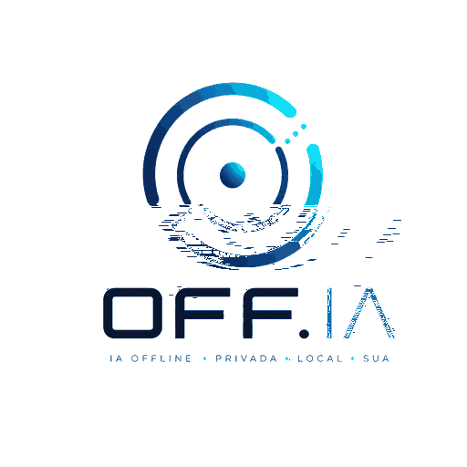

<p align="center">
  
</p>

# OFF.IA

Offline-first AI chat integration layer for **Memoria.ia + Resolutive-DB (BDR) + llama.cpp**.

> Memoria.ia owns memory and state. BDR owns persistence. llama.cpp provides local language-model inference.

Brand assets: [`assets/branding/`](assets/branding/)

## Status

**Android integration candidate.** The repository includes the application boundaries, local llama.cpp runtime, GGUF model handling, Memoria.ia mobile ABI, durable Resolutive-DB path, observability and Android CI. It deliberately does **not** duplicate Memoria.ia or BDR internals.

The Android build is pinned to the corrected Memoria.ia v1.0.0-rc2 commit `162604240f22cfab6449ebe48f4eb764d6e76d0c`. The remaining product gate is physical-device acceptance: same-session paraphrase, kill/restart durable recall and airplane-mode end-to-end behavior. See `docs/DEPENDENCY_REQUESTS.md`.

## Architecture

```text
User / UI
   |
 OFF.IA
   |
   +--> Memoria.ia ----> BDR
   |       |
   |       +--> selected minimal context
   |
   +--> llama.cpp on loopback ----> local GGUF
   |
 response
   |
 Memoria.ia memory update
```

llama.cpp is an inference engine, not a memory layer. OFF.IA does not feed full history automatically in Memoria mode.

## Current components

- `offia.adapters.llama.LlamaCppAdapter`: local OpenAI-compatible `/v1/chat/completions` client; loopback-only by default.
- `offia.models.ModelRegistry`: model metadata and states `MODEL_AVAILABLE`, `MODEL_MISSING`, `MODEL_INVALID`, `MODEL_LOADING`, `MODEL_READY`, `MODEL_ERROR`.
- `offia.adapters.memoria.MemoriaBoundary`: boundary only; semantic implementation belongs to Memoria.ia.
- `offia.adapters.bdr.detect_bdr_v11_memoria_backend`: capability detection only; persistence implementation belongs to BDR/Memoria.ia.
- `offia.runtime.OfflineRuntime`: minimal context -> local language adapter orchestration and memory observability fields.

## llama.cpp integration

Provision llama.cpp separately and run its server bound to loopback with a local GGUF model. OFF.IA defaults to `http://127.0.0.1:8080` and does not download a model automatically.

The repository does not include GGUF weights. Add models to `models/registry.json`; `models/*.gguf` is ignored by Git.

## Tests

```bash
python -m pip install -e .[test]
pytest -q
```

Unit tests use fakes/mocks only and are never evidence of real LLM inference. Real-model and benchmark suites will be added separately and must be explicitly labelled.

## MVP gate

The first meaningful milestone remains:

```text
teach fact -> persist in BDR -> restart -> paraphrased question
-> Memoria.ia retrieves -> llama.cpp answers -> no Internet
```

This repository will not claim that milestone until it is run with a real GGUF model and the stable Memoria.ia/BDR path.

## Scope exclusions for this phase

No ESP32, MA2A federation, automatic cloud fallback, automatic multi-GB model download, or direct Internet exposure of llama.cpp. Android is the active product target.

## Licensing

OFF.IA has not yet been assigned an independent redistribution license. Dependencies retain their own terms. Current Memoria.ia and Resolutive-DB licensing restricts commercial use without authorization; llama.cpp itself is MIT. GGUF model licenses vary by model. See `docs/COMPATIBILITY_ASSESSMENT.md`.
